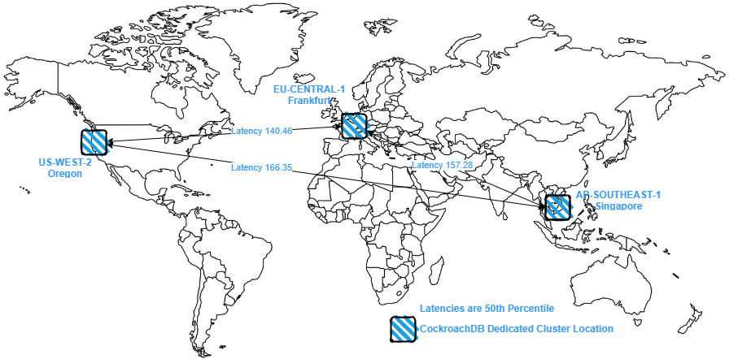

# Multi-Region Testing
Originally built for a West SEssion Hackathon on Multi-Region

- [Multi-Region Testing](#multi-region-testing)
  - [Topology](#topology)
  - [ERD](#erd)

## Topology

## ERD
The starting Entity-Relationship-Diagram (ERD) is below.  

The 3 tables I'm going to focus on are in red and initially they are all Regional-By-Row Tables.   The starting DDL for the tables is avilable [here](schema_starting.sql).  

